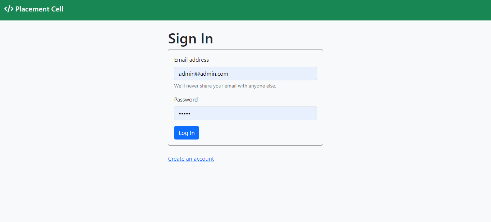
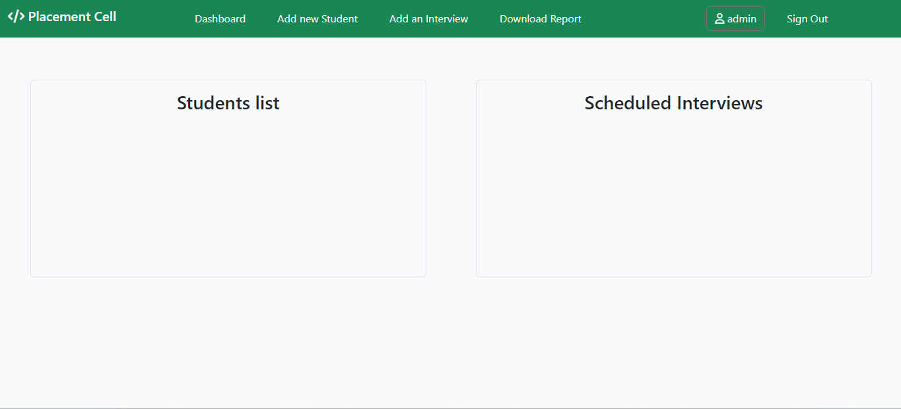

# Placement cell web app

This placement cell web application is created for users/employees to manage interviews of students, and allocate students to companies` interviews.

### Hosted link: [placement cell](https://shy-red-cougar-robe.cyclic.app/)

## Functionality 
- User/Employee signUp and signIn
- Add student 
- Delete student
- Allocate added student to the interview
- Deallocate the student from an interview
- Update user profile
- Download the CSV report
 
## Getting started

* Fork the project 
* Clone the forked repository in your local system
* Create .env file in the root directory and add the following:-
  * PORT="Your port number"
  * MONGODB_URL="Your MongoDB URL"
  * SESSION_SECRET_KEY="Your secret session key"
* Install all required packages
```bash
npm install 
```
* Run project 
```bash
npm start
```
The project is running on the port number provided by you.

## 🛠️ Tools Used 
- NodeJS
- MongoDB
- ExpressJS
- EJS
- Bootstrap

## Screenshots



